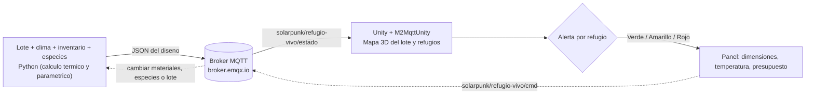

# RefugioVivo, Gemelo Digital de Diseno y Optimizacion de Refugios Modulares


Este es un gemelo digital que me encanta porque une dos cosas que me importan: el bienestar animal y construir con lo que ya existe. Le doy un lote, el clima de la zona, un inventario de materiales reciclados (contenedores, madera recuperada, guadua, llantas, adobe de demolicion, tela de sombra) y las especies de animales rescatados que quiero alojar, y el gemelo me devuelve un diseno: las dimensiones optimas de cada refugio, una curva de temperatura interior esperada de 24 horas, un presupuesto en pesos y un cronograma de construccion. La idea que lo mueve: con lo que desechamos, construimos dignidad para los animales rescatados.

> _Aqui voy a poner una captura o GIF del gemelo funcionando (dejare la imagen en `assets/` y la enlazo)._

## Problema que resuelve

Los santuarios de animales rescatados en Colombia casi siempre operan con poca plata. Un refugio comercial prefabricado es caro, y sin embargo hay materiales reciclados de sobra (contenedores en desuso, madera de demolicion, llantas, guadua) que podrian servir si alguien calculara bien como usarlos. El problema es que "calcular bien" no es obvio: cada especie necesita un rango de temperatura, cierta ventilacion y cierto espacio, y el material del techo cambia por completo cuanto calor entra al mediodia. Lo que quise resolver con este gemelo digital es exactamente eso: tomar el lote, el clima real de la zona y el inventario disponible, y proponer un diseno que quepa, que sea comodo para cada especie, que resista y que entre en el presupuesto, antes de mover un solo bloque.

## Tecnologias

- **Python 3.11+** con `paho-mqtt` para el simulador. No necesita librerias pesadas: los calculos termicos y de optimizacion parametrica van con la libreria estandar (`math`).
- **MQTT** (broker publico `broker.emqx.io`), que mueve todo en **JSON**.
- **Unity** (C#) con **M2MqttUnity** para la visualizacion 3D del lote y los refugios.

## Arquitectura



## Como ejecutar

### 1. Simulador Python

```bash
cd 01_simulador_python
pip install -r requirements.txt
python simulador_refugios.py
```

El simulador arranca con un caso de ejemplo (un lote en Bogota, un inventario de reciclados y unas especies). Para cambiar el diseno en vivo, publico un comando JSON al topico `solarpunk/refugio-vivo/cmd`. Algunos ejemplos:

```bash
# Mas gallinas
mosquitto_pub -h broker.emqx.io -t solarpunk/refugio-vivo/cmd -m '{"animales":{"gallinas":30}}'

# Cambiar de ciudad (recalcula con otro clima)
mosquitto_pub -h broker.emqx.io -t solarpunk/refugio-vivo/cmd -m '{"ciudad":"eje_cafetero"}'

# Menos madera, mas llantas
mosquitto_pub -h broker.emqx.io -t solarpunk/refugio-vivo/cmd -m '{"cmd":"mas_llantas"}'
```

### 2. Visualizacion en Unity

Crea una escena en Unity, agregale el paquete M2MqttUnity y engancha el script principal a un objeto vacio para conectarte al broker MQTT. El script principal lo tienes en [02_unity_visualizacion/Scripts/VisualizadorRefugioVivo.cs](02_unity_visualizacion/Scripts/VisualizadorRefugioVivo.cs).

> **Nota:** en este momento estoy terminando por completo los modelos 3D y la interfaz, asi que la escena visual todavia esta en proceso. Por ahora comparto el simulador, el script de Unity y el caso de estudio; el proyecto Unity completo lo publicare cuando lo tenga listo.

## Estructura del proyecto

```
Proyecto_5_RefugioVivo/
├── 01_simulador_python/
├── 02_unity_visualizacion/
├── 03_documentacion/
└── README.md
```

## Que entra y que sale del gemelo

Estos son los datos que le doy (inputs) y lo que calcula (outputs):

| Entrada | Ejemplos |
|---|---|
| Lote | ancho x largo, pendiente, orientacion cardinal |
| Clima local | Bogota, Medellin o Eje Cafetero (temperatura, lluvia, radiacion, altitud reales) |
| Inventario reciclado | contenedores, madera (m3), guadua (m), llantas, adobe, tela de sombra (m2) |
| Especies a alojar | gallinas, cerdos, cabras, ovejas, con su cantidad |

| Salida | Que calcula |
|---|---|
| Dimensiones por refugio | largo x ancho x alto optimos para el espacio que necesita cada especie |
| Curva termica 24 horas | temperatura interior esperada hora a hora, comparada con el rango ideal de la especie |
| Presupuesto | materiales (a precio local) mas mano de obra por m2, en pesos colombianos |
| Cronograma | semanas de construccion estimadas |
| Alerta por refugio | verde (viable), amarillo (restricciones: horas fuera de rango o falta material), rojo (no cabe o no resiste) |

## Datos reales que uso

- **Bogota:** temperatura promedio 14 C, lluvia ~1.037 mm/ano, radiacion ~4,5 kWh/m2/dia, altitud 2.640 m.
- **Precios aproximados en Colombia (2026):** contenedor 40' usado 3 a 5 millones COP, madera recuperada 200 a 400 mil COP/m3, llantas usadas 5 a 20 mil COP/unidad, adobe de demolicion 1 a 2 mil COP/unidad, guadua 2 a 5 millones COP por cien metros, tela de sombra 30 a 80 mil COP/m2.
- **Propiedades termicas de los materiales:** el acero del contenedor conduce muchisimo calor (mal aislante), mientras la guadua y la madera aislan bien; eso cambia por completo la curva de temperatura interior.

## Roadmap

Lo que quiero hacer mas adelante:

- [ ] Traer clima real por API (IDEAM) segun las coordenadas del lote, en vez de presets por ciudad.
- [ ] Optimizacion de distribucion en el lote (cuadricula, radial) buscando sombra y ventilacion natural.
- [ ] Validacion estructural mas fina (cargas de viento y sismo por region).
- [ ] Modelar cada material en low-poly con textura, en vez de cajas de color.
- [ ] Exportar el diseno como plano PDF y lista de compras lista para la ferreteria.
- [ ] Sacar un build WebGL para tener la demo en vivo con GitHub Pages.

## Enlaces

- Video demo: *(voy a agregar el enlace de YouTube cuando lo grabe)*
- Caso de estudio: [03_documentacion/caso_de_estudio.md](03_documentacion/caso_de_estudio.md)
- LinkedIn: [Juan David Camelo Zarate](https://www.linkedin.com/in/juan-david-camelo-zarate-75a000421/)

## Autor

Soy Juan David Camelo Zarate, estudiante de Ingenieria Multimedia en la UNAD, apasionado por los gemelos digitales.

**Aclaracion importante:** este proyecto es una simulacion con fines de portafolio y aprendizaje. La curva de temperatura interior es un modelo simplificado (no es una simulacion CFD real), pero es util para comparar disenos entre si y ver cual material rinde mejor en cada clima. Los precios y datos climaticos son reales y aproximados; el objetivo es mostrar la arquitectura y la logica que se necesitaria para acompanar la construccion real de un refugio.
